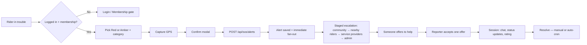
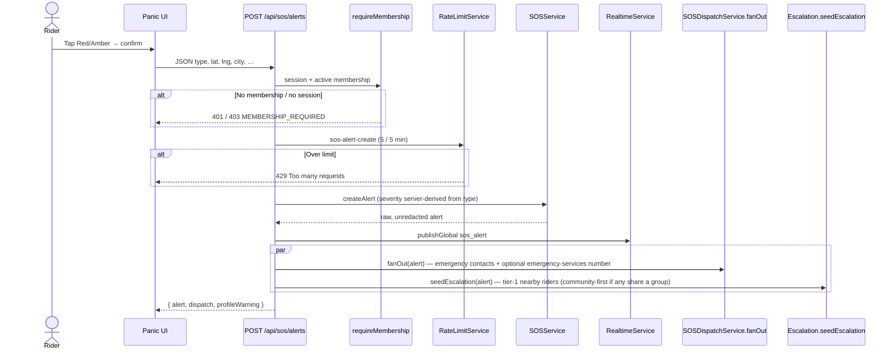
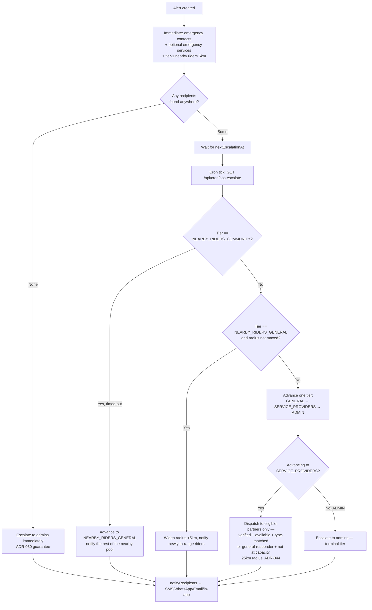
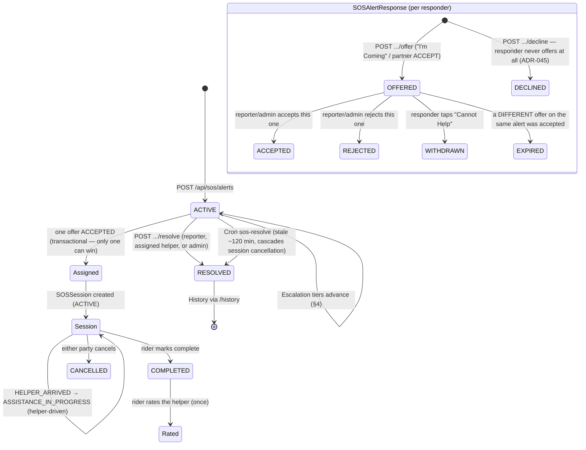
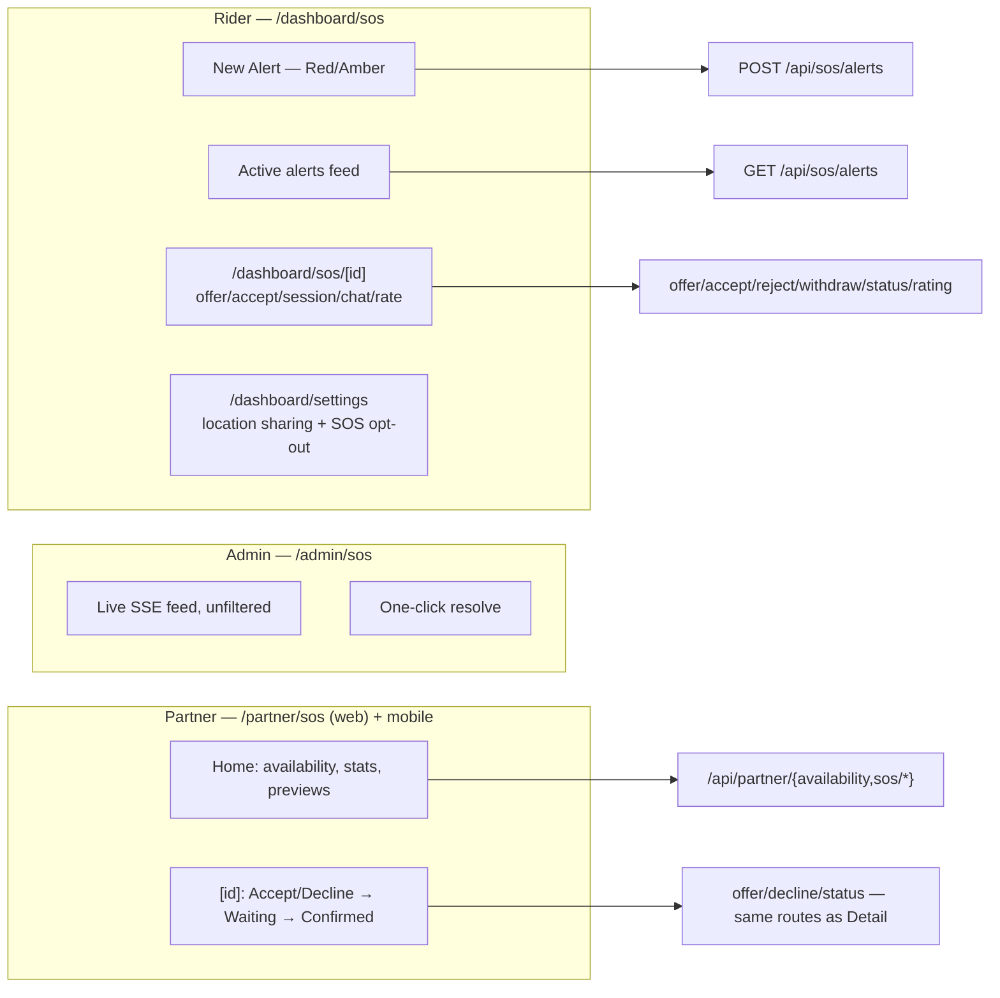

# BIKIE — SOS Feature

Membership-gated emergency / assistance alerts. A rider sends a **Red** or **Amber** alert with
live GPS; BIKIE fans out in stages — emergency contacts and nearby riders immediately, service
providers and admins as later escalation tiers — over **SMS / WhatsApp / Email / in-app** (only
where each channel is configured and the recipient has the matching contact detail). A responder
offers to help, the reporter accepts one offer, and the two of them run an assisted session
(chat, status updates, rating) through to completion.

Related: `API.md` (routes), `PRODUCTION_INTEGRATIONS.md` (vendors), ADR-016 / ADR-018 / ADR-020 /
ADR-028 / ADR-029 / ADR-030 / ADR-033 / ADR-036 / ADR-038 / ADR-042 / ADR-044 / ADR-045 in
`DECISIONS.md`.

---

## 1. Story (one glance)

---

## 2. Alert kinds

| Kind      | UI label                 | Intent                                                     |
| --------- | ------------------------ | ------------------------------------------------------------ |
| **RED**   | Red Alert — Emergency    | Accident, medical, life-threatening — strongest confirm copy |
| **AMBER** | Amber Alert — Assistance | Breakdown, fuel, lost — help needed, less critical tone       |

**Categories** (API `type`, `SOSAlertType` enum): `ACCIDENT` · `LIFE_THREATENING` · `MEDICAL` ·
`BIKE_BREAKDOWN` · `FLAT_TYRE` · `FUEL_EMPTY` · `BATTERY_ISSUE` · `LOST` · `OTHER`.

`ACCIDENT` / `LIFE_THREATENING` / `MEDICAL` have no natural `Partner.type` mapping and only reach
service providers who've opted in as a general responder (`isGeneralResponder`, ADR-044); the
rest map to a specific partner type (`partnerTypeForAlertType`, `domain/partner-mapping.ts`).

---

## 3. Create-alert sequence (happy path)

`dispatch`/`profileWarning` report what actually happened — real per-channel `sent/attempted`
counts and a distinct "nobody reached" state, never a fixed "sent via SMS/WhatsApp/email"
sentence (ADR-030).

---

## 4. Staged escalation (who gets notified, and when)

Unlike an early version of this feature, service providers and admins are **not** notified at
creation time — only emergency contacts, an optional configured emergency-services number, and a
first tier of nearby riders go out immediately. A cron ticker (`GET /api/cron/sos-escalate`)
widens the search over time if nobody has been assigned yet.

**Community-first (ADR-033 Phase D).** If any nearby rider shares a Community/Club with the
reporter, the tier starts at `NEARBY_RIDERS_COMMUNITY` (shorter timeout, notifies only that
subset) before falling through to the full nearby pool at `NEARBY_RIDERS_GENERAL`. No shared
group members nearby → starts at `NEARBY_RIDERS_GENERAL` directly.

**Service-provider eligibility (ADR-044, fixed a real bug in ADR-045's predecessor).** A partner
is only ever dispatched an alert if: verified, currently `isAvailable`, within 25km, category-
matched (`partnerTypeForAlertType`) or opted in as `isGeneralResponder` for unmapped categories,
and not already the assigned helper on another active session. There is **no** "broaden to
anyone if the strict search comes up empty" fallback — a fuel-delivery partner will never receive
a medical emergency. The alert never reaches nobody regardless: `tickEscalation` still advances
`SERVICE_PROVIDERS → ADMIN` unconditionally after a timeout.

**Rider SOS opt-out (ADR-045).** A rider with `RiderLocation.receiveSosAlerts = false` never
appears in the nearby-rider candidate pool (`findNearbyAroundPoint`'s SQL, alongside the existing
`sharingEnabled` filter) — independent of their location-sharing status. Defaults `true`.

**Channel rule (ADR-029):** a channel is used only when the **provider is configured** *and* the
recipient has that contact field (phone → SMS/WhatsApp, email → email). Unconfigured WhatsApp
still yields a `wa.me` click-to-send link for manual escalation. Service-provider push copy is
distinct (`"🚨 Emergency Assistance Needed"` + category + distance + city, ADR-044) from the
generic rider-facing copy.

**Never-silent rule (ADR-030):** an alert that resolves to zero recipients anywhere escalates to
platform admins immediately, logs `[SOS][DISPATCH][NO-RECIPIENTS]`, and reports
`escalatedToAdmins` in the summary. The reporter always receives an in-app notice regardless of
provider configuration.

---

## 5. Offer → accept → session lifecycle

Not a simple "notify → done" flow. A responder's relationship to an alert is tracked as an
`SOSAlertResponse`; once the reporter accepts one offer, a dedicated `SOSSession` (chat, status
timeline, rating) takes over.

The reporter accepting an offer is one atomic transaction
(`sos-session.repository.ts`'s `acceptOffer`): it claims `SOSAlert.assignedHelperId`, flips the
accepted offer to `ACCEPTED`, **expires every other still-`OFFERED` response on that alert in the
same step**, and creates the `Conversation` + `SOSSession` — no orphaned `OFFERED` rows survive a
successful accept, and a losing concurrent accept attempt gets `409`/a typed error, never a
silent overwrite.

**Decline (ADR-045).** A responder — typically a service provider browsing "Nearby Requests" —
can decline without ever offering (`POST /api/sos/alerts/[id]/decline`). This is a real,
persisted decision (same `SOSAlertResponse` table, `DECLINED` status), not a local UI dismissal:
it excludes that alert from the responder's own future "Nearby Requests" list. It does **not**
notify the reporter or appear in the alert's timeline — a private signal, same as silently not
offering always was.

---

## 6. PII redaction (ADR-045)

Before anyone is assigned, most of a reporter's identifying info is withheld from anyone browsing
or viewing the alert who isn't the reporter, the eventually-assigned helper, or an admin.

| Field | Non-privileged viewer | Reporter / assigned helper / admin |
|---|---|---|
| `userName`, `type`, `severity`, `city`, `description` | visible | visible |
| `userPhone`, `userEmail` | `null` | visible |
| `latitude`, `longitude` | `null` | visible |
| `placeName`, `area`, `formattedAddress` (reverse-geocoded) | `null` | visible |
| `distanceMeters` (list endpoint only, viewer-computed) | visible | visible |

Enforced in `sos.application.ts`'s `getActiveAlerts`/`getAlertById` via
`redactAlertForViewer`/`isPrivilegedViewer` (`domain/pii-redaction.ts`) — applied once, right at
the HTTP boundary. Every other internal consumer (dispatch, sessions, the partner dashboard)
works with the always-raw `RawSOSAlertDTO` shape; redaction never leaks into business logic that
doesn't need it. `distanceMeters` is deliberately never redacted — it's derived, not identifying,
and is what keeps a redacted browse list usable ("2.8 km away" without exposing exactly where).

---

## 7. Route table

| Route | Method | Who | Notes |
| ----------------------------------------------- | ------ | ------------------ | -------------------------------------------------------------------- |
| `/api/sos/alerts` | GET | Member | `?lat=&lng=` (ADR-042) — 25km radius around the viewer; non-admin must supply both. Results redacted per §6. Admin sees every alert network-wide, unfiltered. |
| `/api/sos/alerts` | POST | Member | Create + immediate fan-out + tier-1 escalation seed. |
| `/api/sos/alerts/history` | GET | Session | Caller's own past alerts. |
| `/api/sos/alerts/[id]` | GET | Member | Alert + timeline. Redacted per §6 unless privileged. |
| `/api/sos/alerts/[id]/offer` | POST | Member | "I'm Coming" / partner "ACCEPT". Partner callers additionally gated: verified, available, category-matched, not at capacity. |
| `/api/sos/alerts/[id]/decline` | POST | Member | Decline without ever offering (ADR-045). |
| `/api/sos/alerts/[id]/offers` | GET | Reporter/admin only | Offers received; responder phone withheld until `ACCEPTED`. |
| `/api/sos/alerts/[id]/offers/[offerId]/accept` | POST | Reporter/admin | Transactional assignment. |
| `/api/sos/alerts/[id]/offers/[offerId]/reject` | POST | Reporter/admin | Declines a specific offer without assigning. |
| `/api/sos/alerts/[id]/offers/[offerId]/withdraw` | POST | Offer owner | "Cannot Help." |
| `/api/sos/alerts/[id]/respond` | POST | Member | **Deprecated alias** for `/offer` (ADR-028) — kept for older clients. |
| `/api/sos/alerts/[id]/resolve` | POST | Reporter/helper/admin | Mark resolved. |
| `/api/sos/sessions/[id]` | GET | Session participants/admin | Session detail. |
| `/api/sos/sessions/[id]/status` | POST | Helper/rider/admin | `HELPER_ARRIVED`/`ASSISTANCE_IN_PROGRESS` (helper), `COMPLETED` (rider), `CANCELLED` (either). |
| `/api/sos/sessions/[id]/rating` | POST | Rider | Post-`COMPLETED`, once. |
| `/api/sos/partners` | GET | Member | `?city=&type=` — "Share Mechanic"/"Share Fuel Contact." City-string matched, not radius (known limitation, ADR-036). |
| `/api/rider-location/consent` | GET/PUT | Member | Live location sharing (findable/browsable) — separate from SOS opt-out below. |
| `/api/rider-location/sos-opt-out` | GET/PUT | Member | ADR-045 — independent of consent above: whether this rider is paged for SOS at all. |
| `/api/partner/availability` | PATCH | Partner | 🟢/⚫ toggle (ADR-044). |
| `/api/partner/sos/dashboard` | GET | Partner | Stats (ADR-044). |
| `/api/partner/sos/nearby` | GET | Partner | Eligible open requests, excludes already-offered/declined (ADR-045). |
| `/api/partner/sos/active` | GET | Partner | Current active-helper sessions. |
| `/api/cron/sos-resolve` | GET | Cron Bearer | Auto-resolves alerts inactive 120+ min. |
| `/api/cron/sos-escalate` | GET | Cron Bearer | The staged-escalation ticker (§4). |

---

## 8. Web and mobile surfaces

- **Rider** (web `/dashboard/sos*`, mobile `sos_screen.dart`/`sos_detail_screen.dart`): create,
  browse (redacted per §6), offer/accept/reject/withdraw, session chat/status/rating. Web and
  mobile are functionally at parity here.
- **Admin** (`/admin/sos`, web only): live SSE feed of every alert network-wide, one-click
  resolve, full access to any alert/session/offer via the generic detail page.
- **Partner** (ADR-044 mobile, ADR-045 web): a dedicated Emergency Assistance Dashboard — separate
  screens from the generic rider flow on both platforms, not a modification of it. Availability
  toggle, live stats, a distance-sorted eligible-requests list, and the same
  Accept/Decline/Waiting/Confirmed flow, built on the identical offer/accept/session backend the
  rider flow uses. `PUT /api/partner/profile` additionally accepts `isGeneralResponder`.
- **Nearby help** (`GET /api/places/nearby`, Google Places) is a separate, unrelated feature —
  petrol/mechanic/hospital lookup, not panic fan-out.
- Profile **phone** + **emergency contacts** improve dispatch quality
  (`profileWarning` in the create-alert response if phone is missing).

---

## 9. Providers (production)

| Channel                             | Primary           | Fallback                            |
| ------------------------------------ | ------------------ | ------------------------------------ |
| SMS                                  | MSG91 (ADR-031)   | DEV console log                     |
| WhatsApp                             | Meta Cloud API    | Twilio WhatsApp → `wa.me` link      |
| Email                                | SMTP (nodemailer) | Resend → DEV log                    |
| Push                                 | Firebase FCM      | DEV log                             |
| Realtime / rate limit / idempotency  | Upstash Redis     | In-memory degrade (never block SOS) |

Full vendor table: `.docs/PRODUCTION_INTEGRATIONS.md`.

---

## 10. Key files

| Area                        | Path                                                                                       |
| ---------------------------- | -------------------------------------------------------------------------------------------- |
| Rider create/browse UI       | `apps/web/components/shared/PanicAlertCards.tsx`, `apps/mobile/lib/features/sos/`           |
| Rider/generic detail UI      | `apps/web/app/(main)/dashboard/sos/[id]/page.tsx`, `sos_detail_screen.dart`                 |
| Partner dashboard UI         | `apps/web/app/(main)/partner/sos/`, `apps/mobile/lib/features/partner_dashboard/`           |
| Create API                   | `apps/web/app/api/sos/alerts/route.ts`                                                       |
| Offer/session/decline API    | `apps/web/app/api/sos/alerts/[id]/{offer,decline,offers,resolve}`, `apps/web/app/api/sos/sessions/[id]/*` |
| Escalation                   | `packages/services/.../safety-location/application/escalation.application.ts`               |
| Fan-out                      | `packages/services/.../safety-location/application/fan-out.application.ts`                  |
| PII redaction                | `packages/services/.../safety-location/domain/pii-redaction.ts`                              |
| Rider opt-out                | `packages/database/.../rider-location.repository.ts`, `apps/web/app/api/rider-location/sos-opt-out/route.ts` |
| Facades                      | `packages/services/src/sos.service.ts`, `sos-session.service.ts`, `sos-dispatch.service.ts`, `rider-location.service.ts` |
| Tests                        | `packages/services/.../safety-location/safety-location.test.ts` (unit), `safety-location.e2e.test.ts` (full-flow) |

---

*Mermaid diagrams render in GitHub, most IDEs, and Cursor markdown preview.*
