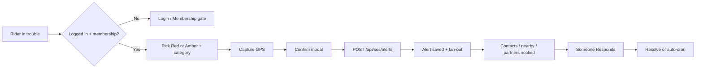
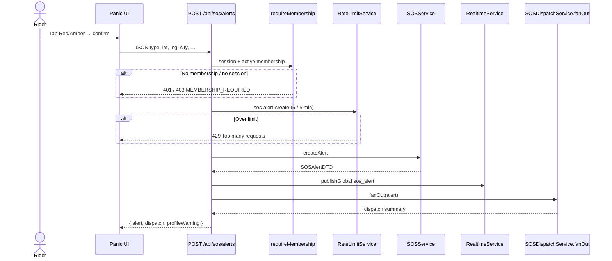
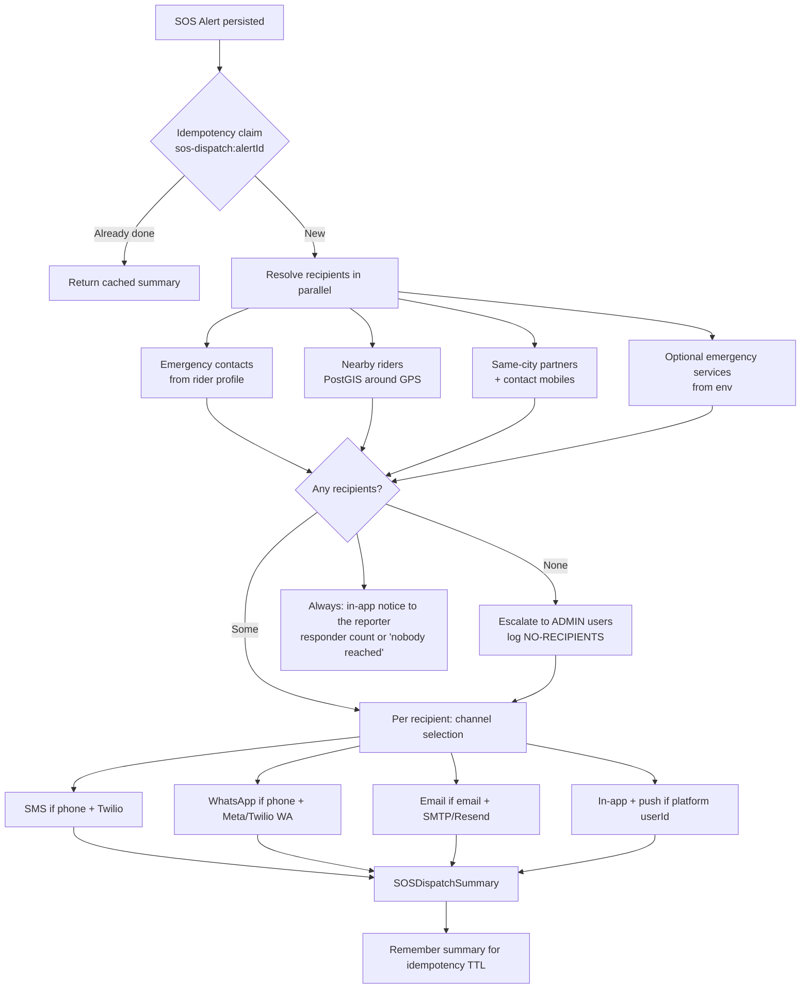
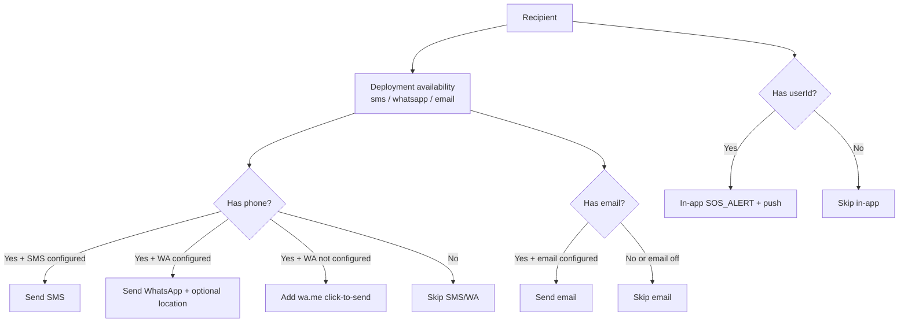
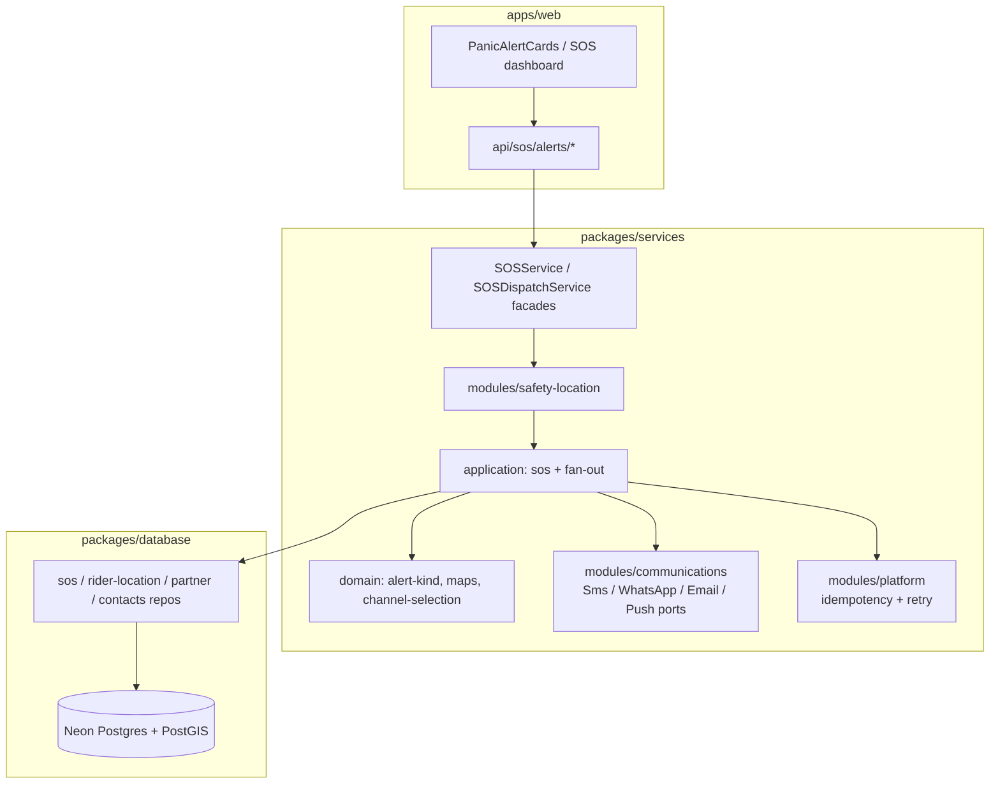
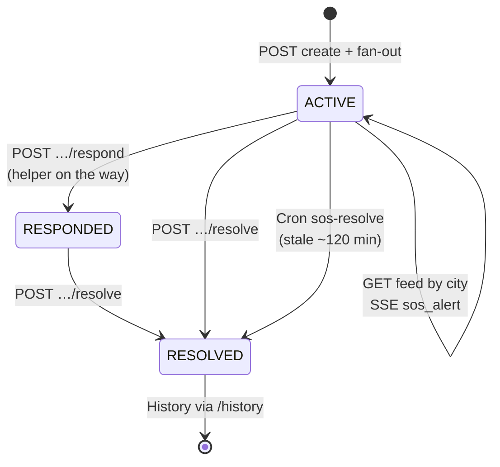
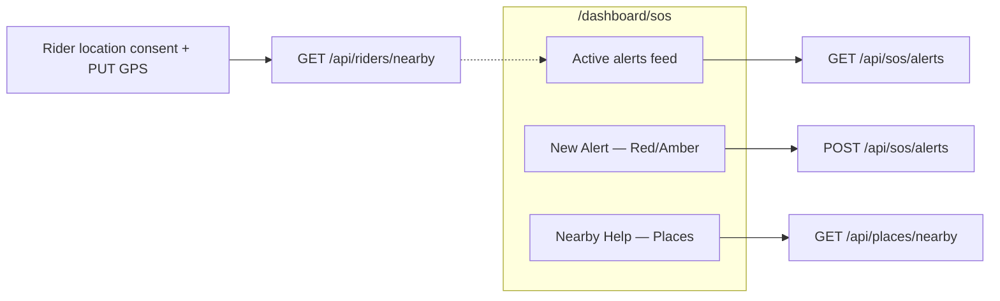

# BIKIE — SOS Feature

Membership-gated emergency / assistance alerts. A rider sends a **Red** or **Amber** alert with live GPS; BIKIE fans out to emergency contacts, nearby riders, and same-city partners over **SMS / WhatsApp / Email / in-app** (only where each channel is configured and the recipient has the matching contact detail).

Related: `API.md` (routes), `PRODUCTION_INTEGRATIONS.md` (vendors), ADR-016 / ADR-018 / ADR-020 / ADR-029 in `DECISIONS.md`.

---

## 1. Story (one glance)




---


## 2. Alert kinds


| Kind      | UI label                 | Intent                                                     |
| --------- | ------------------------ | ---------------------------------------------------------- |
| **RED**   | Red Alert — Emergency    | Accident, medical, serious hazard — strongest confirm copy |
| **AMBER** | Amber Alert — Assistance | Breakdown, fuel, lost — help needed, less critical tone    |


**Categories** (API `type`): `ACCIDENT` · `BIKE_BREAKDOWN` · `FUEL_EMPTY` · `MEDICAL` · `LOST` · `OTHER`

---


## 3. Create-alert sequence (happy path)




---


## 4. Fan-out: who gets notified




**Channel rule (ADR-029):** a channel is used only when the **provider is configured** *and* the recipient has that contact field (phone → SMS/WhatsApp, email → email). Unconfigured WhatsApp still yields a `wa.me` click-to-send link for manual escalation.

**Never-silent rule (ADR-030):** an alert that resolves to zero recipients escalates to platform admins, logs `[SOS][DISPATCH][NO-RECIPIENTS]`, and reports `escalatedToAdmins` in the summary. The reporter always receives an in-app notice regardless of provider configuration, and the confirmation screen renders the real summary — recipient counts, per-channel `sent/attempted`, and which channels are unconfigured — instead of a fixed "sent via SMS, WhatsApp, and email" sentence. Emergency contacts may carry an optional `email`, so they are reachable by email too.

Reading a dispatch log line:

```
[SOS][DISPATCH] alert=… nearby=0 providers=0 contacts=0 sms=0/0 wa=0/0 email=0/0 inApp=0 admins=1 channels=sms:on,wa:off,email:off
```

`nearby/providers/contacts` are recipient coverage (a data/consent problem when zero); `channels=…:off` is a missing-credentials problem; `admins>0` means the alert reached nobody and had to be escalated.

---


## 5. Channel decision (per recipient)




---


## 6. Module layout (code)




Layering: **UI → Route → Service facade → safety-location application → ports → repositories / provider adapters.**

---


## 7. Lifecycle after send




| Route                               | Who         | What                                         |
| ----------------------------------- | ----------- | -------------------------------------------- |
| `GET /api/sos/alerts?city=`         | Member      | Active alerts (non-admin **must** pass city) |
| `POST /api/sos/alerts`              | Member      | Create + fan-out                             |
| `GET /api/sos/alerts/history`       | Session     | Caller’s past alerts                         |
| `POST /api/sos/alerts/[id]/respond` | Member      | Notify reporter you’re nearby                |
| `POST /api/sos/alerts/[id]/resolve` | Session     | Mark resolved                                |
| `GET /api/cron/sos-resolve`         | Cron Bearer | Auto-resolve stale alerts                    |


---


## 8. Related SOS surfaces




- **Nearby riders** need sharing consent + a recent GPS fix (PostGIS radius, default ~10 km via `SOS_NEARBY_RADIUS_KM`).
- **Nearby help** uses Google Places (petrol / mechanic / hospital) — separate from panic fan-out.
- Profile **phone** + **emergency contacts** improve dispatch quality (`profileWarning` if phone missing).

---


## 9. Providers (production)


| Channel                             | Primary           | Fallback                            |
| ----------------------------------- | ----------------- | ----------------------------------- |
| SMS                                 | Twilio            | DEV console log                     |
| WhatsApp                            | Meta Cloud API    | Twilio WhatsApp → `wa.me` link      |
| Email                               | SMTP (nodemailer) | Resend → DEV log                    |
| Push                                | Firebase FCM      | DEV log                             |
| Realtime / rate limit / idempotency | Upstash Redis     | In-memory degrade (never block SOS) |


Full vendor table: `.docs/PRODUCTION_INTEGRATIONS.md`.

---


## 10. Key files


| Area           | Path                                                                               |
| -------------- | ---------------------------------------------------------------------------------- |
| UI             | `apps/web/components/shared/PanicAlertCards.tsx`                                   |
| Create API     | `apps/web/app/api/sos/alerts/route.ts`                                             |
| Fan-out        | `packages/services/src/modules/safety-location/application/fan-out.application.ts` |
| Channel policy | `packages/services/src/modules/safety-location/domain/channel-selection.ts`        |
| Facades        | `packages/services/src/sos.service.ts`, `sos-dispatch.service.ts`                  |


---

*Mermaid diagrams render in GitHub, most IDEs, and Cursor markdown preview.*