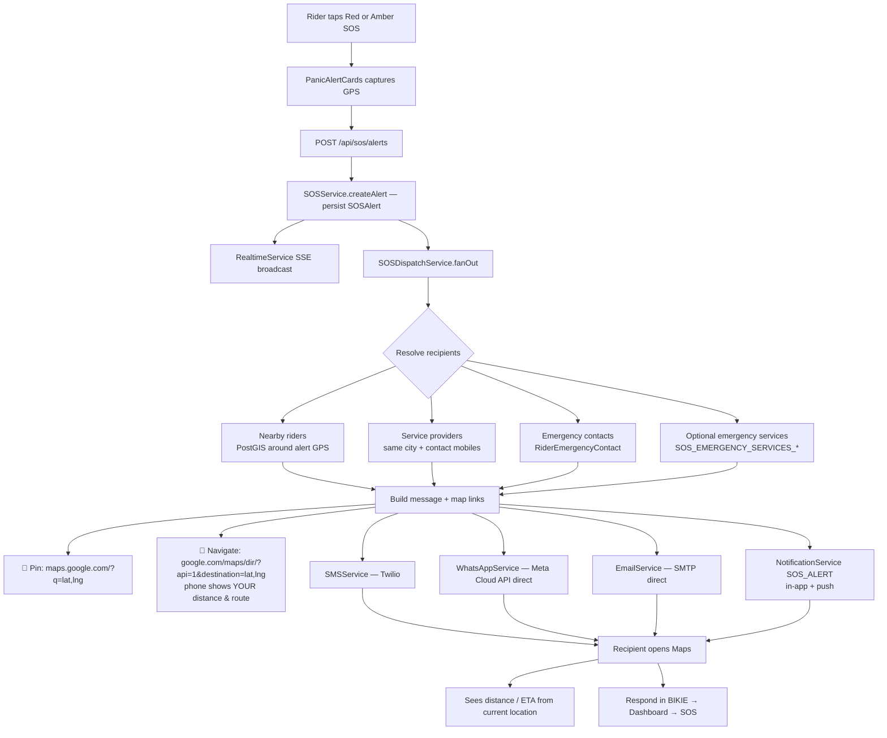
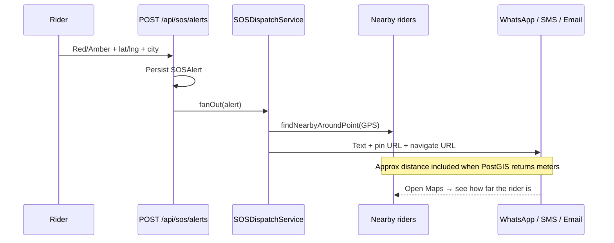
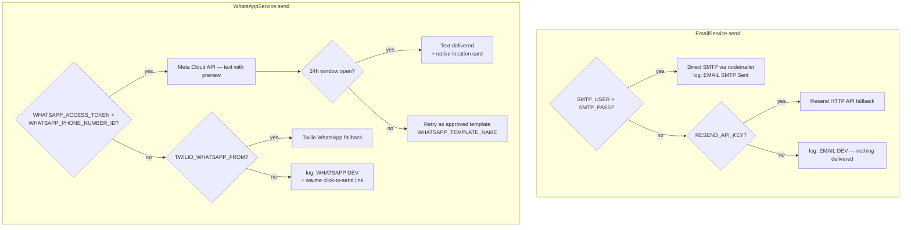

# SOS Dispatch — End-to-End Testing Guide

Use this checklist to verify Red/Amber panic fan-out with **WhatsApp-style map links** (open Maps → see distance/route from your phone).

Email and WhatsApp are sent **directly** — email over plain SMTP from your own mailbox (no Resend/SendGrid in between) and WhatsApp over Meta's own WhatsApp Cloud API (no Twilio in between). Both fall back gracefully: with no credentials the server logs `[SMS|WHATSAPP|EMAIL][DEV]`, and WhatsApp additionally prints a `wa.me` click-to-send link so the alert can still be pushed by hand. See §4 for the exact credentials.

---

## Flow (Mermaid)





### Channel provider selection



---

## 0. Prerequisites

1. App running (Docker on `:3001` or `pnpm dev`).
2. DB migrated.
3. Seed applied **while the app is up**:

```powershell
docker compose --env-file ./apps/.env exec -T `
  -e BETTER_AUTH_URL=http://localhost:3001 `
  -e DATABASE_ADAPTER=pg `
  web sh -c "cd /app/packages/database && pnpm exec tsx prisma/seed.ts"
```

Optional smoke:

```powershell
docker cp .\docker\sos-e2e-smoke.sh bikie-web-1:/tmp/sos-e2e-smoke.sh
docker compose --env-file ./apps/.env exec -T web sh /tmp/sos-e2e-smoke.sh
```

---

## 1. Seeded SOS actors (updated for live inbox testing)

| Role | Login email | Password | WhatsApp / phone | Notes |
|---|---|---|---|---|
| Demo rider (reporter) | `rider@bikie.app` | `Rider@12345` | `+919900001111` | Premium membership + emergency contacts |
| Nearby rider 1 | `arun8107800370@gmail.com` | `Nearby@12345` | `+918107800370` | Live GPS near Bangalore seed point |
| Nearby rider 2 | `sharmamo@gmail.com` | `Nearby@12345` | `+919664361738` | Live GPS near Bangalore seed point |
| Service provider | `partner@bikie.app` | `Partner@12345` | city **Bangalore** | Contact mobiles seeded |
| Admin | `admin@bikie.app` | `Admin@12345` | — | Live SOS feed |

**Seed GPS / city:** `12.9716, 77.5946` / `Bangalore`

**Emergency contacts (phones):** `+919911112222`, `+919933334444`

---

## 2. What “map link like WhatsApp” means here

Each SMS / WhatsApp / email / in-app SOS notification includes:

1. **Location pin** — `https://maps.google.com/?q=<lat>,<lng>` (drop a pin, same idea as sharing a location).
2. **Navigate link** — `https://www.google.com/maps/dir/?api=1&destination=<lat>,<lng>`  
   On a phone this opens Google Maps **directions to the rider**. Maps uses *your* GPS as the origin, so you see **distance + ETA + route**.

Nearby riders also get an approximate distance from PostGIS in the message body (`Your distance (approx): X.X km away`).

In-app Notifications show an orange **Open in Maps — see distance & route** button for `SOS_ALERT` items.

---

## 3. Manual UI test (Red Alert)

1. Log in as `rider@bikie.app`.
2. Homepage Panic section or `/dashboard/sos` → New Alert.
3. Allow location **or** city `Bangalore` (+ seed GPS via API if needed).
4. Send **Red Alert**.
5. Log in as `arun8107800370@gmail.com` → `/dashboard/notifications`:
   - Title **Red Alert nearby**
   - Body includes Maps URL
   - Orange Maps button opens navigate link
6. Check phone `8107800370` / `9664361738` and emails for the same Maps links (live or `[DEV]` logs).

### Assert in server logs

```
[SOS][DISPATCH] alert=... nearby=2 ... sms=7/7 wa=2/7 email=4/4 inApp=3
[SMS][TWILIO] Sent to +918107800370
[WHATSAPP][META] Sent to 918107800370
[EMAIL][SMTP] Sent to arun8107800370@gmail.com | id=<...>
```

Without credentials the same lines appear as `[SMS][DEV]` / `[WHATSAPP][DEV] ... Click to send: https://wa.me/...` / `[EMAIL][DEV]`, and failures are summarised at the end as `[SOS][DISPATCH][ERROR] <channel> → <target>: <provider message>`.

---

## 4. Sending for real from local (credential checklist)

No code change is needed for any of this — fill `apps/.env` and restart the container.

| Channel | How it sends | Status |
|---|---|---|
| **SMS** | Twilio Messaging Service | Live — credentials already in `apps/.env` |
| **Email** | Direct SMTP from your own mailbox | Needs `SMTP_USER` + `SMTP_PASS` |
| **WhatsApp** | Meta WhatsApp Cloud API (direct) | Needs `WHATSAPP_ACCESS_TOKEN` + `WHATSAPP_PHONE_NUMBER_ID` |

### 4a. Email — direct SMTP (Gmail App Password)

Gmail rejects your normal password over SMTP; you need a 16-character App Password.

1. Google Account → **Security** → enable **2-Step Verification**.
2. Security → **App passwords** → app "Mail", device "Other (BIKIE)" → copy the 16 characters.
3. Fill `apps/.env`:

```env
SMTP_HOST=smtp.gmail.com
SMTP_PORT=587
SMTP_SECURE=false
SMTP_USER=arun8107800370@gmail.com
SMTP_PASS=abcdefghijklmnop
EMAIL_FROM=BIKIE SOS <arun8107800370@gmail.com>
```

4. `docker compose --env-file ./apps/.env up -d --force-recreate web`
5. Trigger an alert — logs should read `[EMAIL][SMTP] Sent to ... | id=<...>` and the mail arrives within seconds.

> Gmail SMTP allows roughly 500 recipients/day, which is plenty for testing. Any other provider works too — set `SMTP_HOST`/`SMTP_PORT` accordingly (`465` + `SMTP_SECURE=true` for implicit TLS).

### 4b. WhatsApp — direct Meta Cloud API

1. [developers.facebook.com](https://developers.facebook.com/) → **My Apps** → Create app → type **Business**.
2. Add the **WhatsApp** product → **API Setup**.
3. Copy the **temporary access token** (24h) and the **Phone number ID** of the test sender.
4. Under **To**, add `+918107800370` and `+919664361738` as recipient numbers and confirm the OTP each phone receives. Test senders can only message verified recipients.
5. Fill `apps/.env`:

```env
WHATSAPP_ACCESS_TOKEN=EAAG...
WHATSAPP_PHONE_NUMBER_ID=123456789012345
WHATSAPP_API_VERSION=v22.0
```

6. Restart, trigger an alert → logs read `[WHATSAPP][META] Sent to 918107800370`, and the phone gets the alert text **plus a native WhatsApp location card** (tap → Maps with distance).

**24-hour window:** free-form text only delivers if that number messaged your business number in the last 24 hours. For a fresh number, either reply once from the phone to open the window, or create an approved template with a single `{{1}}` body parameter and set `WHATSAPP_TEMPLATE_NAME` — the service retries as a template automatically.

**Going to production:** swap the temporary token for a permanent System User token and verify the business. Only these two env values change.

### 4c. Zero-credential fallback (works right now)

With no WhatsApp credentials, every recipient still produces a click-to-send link in the logs and in the API response under `whatsappClickToSend`:

```
[SOS][DISPATCH][WA-LINK] Nearby Rider 1 +918107800370 https://wa.me/918107800370?text=BIKIE%20RED%20ALERT...
```

Open that URL and WhatsApp Web/desktop composes the full alert with map links — one tap to actually deliver it.

---

## 5. Expected `dispatch` summary (API)

`*Attempted` counts recipients targeted; `*Sent` counts provider-confirmed deliveries, so the two only match once live credentials are in place.

```json
{
  "nearbyRiders": 2,
  "serviceProviders": 3,
  "emergencyContacts": 2,
  "emergencyServices": 0,
  "smsAttempted": 7,
  "smsSent": 7,
  "whatsappAttempted": 7,
  "whatsappSent": 2,
  "emailAttempted": 4,
  "emailSent": 4,
  "inAppNotified": 3,
  "whatsappClickToSend": [],
  "errors": []
}
```

`errors` carries the provider's own rejection text (Twilio/Meta/SMTP), truncated to 200 chars — the fastest way to see *why* something didn't land.

---

## 6. Failure modes

| Case | Expected |
|---|---|
| No membership | `403 MEMBERSHIP_REQUIRED` |
| No GPS + empty city | `400` validation |
| No WhatsApp credentials | `[WHATSAPP][DEV]` log + `wa.me` link in `whatsappClickToSend`; SMS/email unaffected |
| No SMTP credentials | `[EMAIL][DEV]` log, `emailSent: 0` |
| Gmail rejects login | `[EMAIL][SMTP] Failed ... Username and Password not accepted` → use an App Password, not the account password |
| Meta error `131047` | Recipient outside the 24h window → reply once from that phone, or set `WHATSAPP_TEMPLATE_NAME` |
| Meta error `131030` | Number not in the test app's allow-list → add it under WhatsApp → API Setup → To |
| Recipient opens navigate link | Google Maps shows route + distance from their location |

---

## 7. Related docs

- Plan: `project doc/SOS_DISPATCH_PLAN.md`
- API: `.docs/API.md` (SOS section)
- ADR-018 in `.docs/DECISIONS.md`
